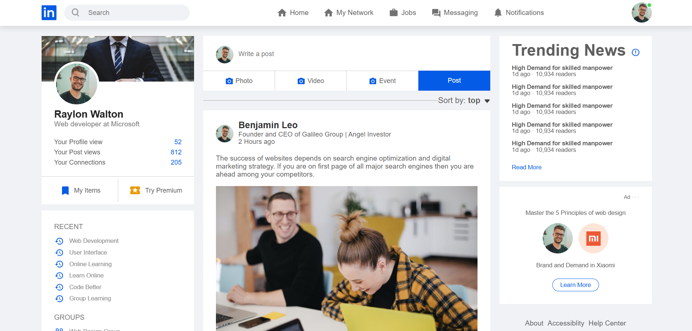
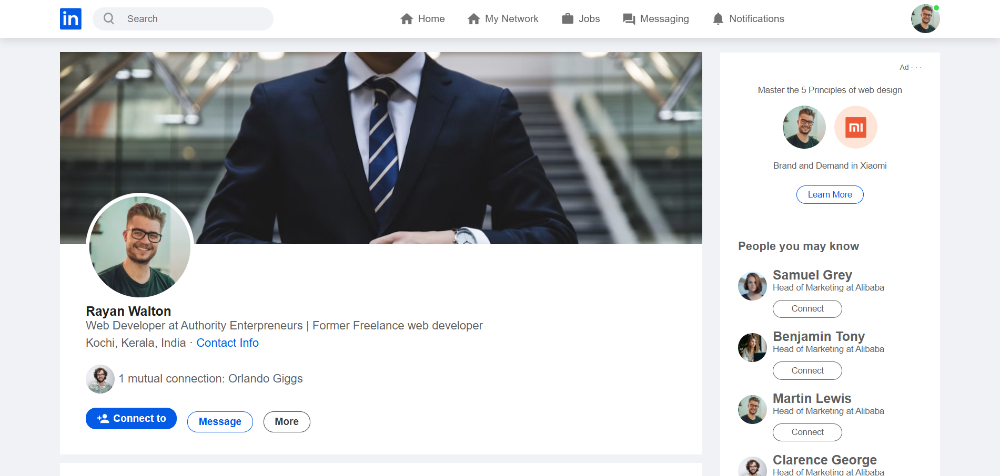
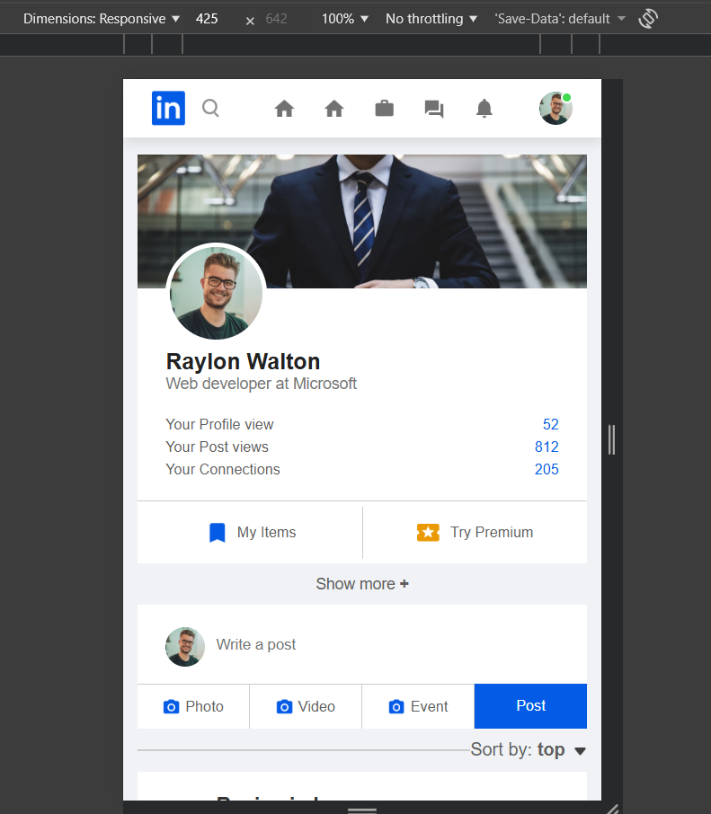
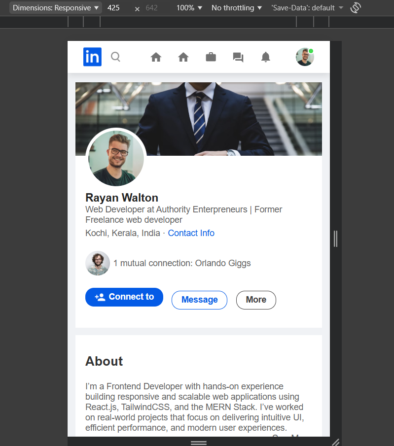

# LinkedIn Clone (Frontend)

A fully responsive **LinkedIn UI clone** built using pure **HTML, CSS, and vanilla JavaScript**. This project replicates the core layout and interactive features of LinkedIn's homepage and user profile page — perfect for portfolios, learning, or as a foundation for a full-stack social network.

## Live Demo
[Click here to view the live project](#) 

## Screenshots

| Home Feed (Desktop)                  | Profile Page (Desktop)               |
|--------------------------------------|--------------------------------------|
|  |  |

| Mobile View (Home)                   | Mobile View (Profile)                |
|--------------------------------------|--------------------------------------|
|  |  |

## Features Implemented

- Responsive navigation bar with search and profile dropdown
- Sticky sidebar (Recent activities, Groups, Hashtags) with "Show more/less" toggle
- Complete home feed with posts, likes, comments, shares, and reactions
- Fully styled post creation box
- Detailed user profile page (About, Experience, Education, Skills, Languages)
- Profile dropdown menu with smooth toggle animation
- Mobile-first responsive design (collapses sidebars on small screens)
- Clean, modern UI mimicking LinkedIn’s 2022–2025 design language

## Tech Stack

- **HTML5**
- **CSS3** (Flexbox, Grid, custom properties, responsive units)
- **Vanilla JavaScript** (DOM manipulation, event handling)
- **Google Fonts** – Poppins

## Project Structure

```
linkedin-clone/
├── index.html              # Home feed page
├── profile.html            # User profile page
├── style.css               # All styles (single stylesheet)
├── images/                 # All icons and placeholder images
│   ├── logo.png
│   ├── user-1.png
│   ├── cover-pic.png
│   └── ... (other assets)
├── screenshots/            
└── README.md
```

## How to Run Locally

1. Clone or download the repository
   ```bash
   git clone https://github.com/JoyelV/LinkedIn_Clone.git
   ```
2. Open `index.html` in your browser
   ```bash
   cd linkedin-clone
   open index.html   # Mac
   # or simply double-click the file
   ```

No build tools or server required!

## Future Enhancements (Ideas)

- Add dark mode toggle
- Implement real post creation with localStorage
- Connect to a backend (Node.js + MongoDB) for user auth & real posts
- Add infinite scroll for feed
- Implement real-time notifications
- Add messaging interface

## Credits

- Inspired by LinkedIn's UI (2022–2025 design)
- Icons & placeholder images sourced from various free resources
- Built with ❤️ by Joyel Varghese

## License

This project is open-source and available under the [MIT License](LICENSE).